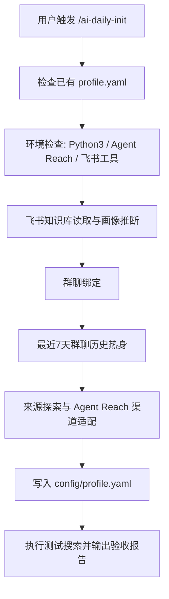
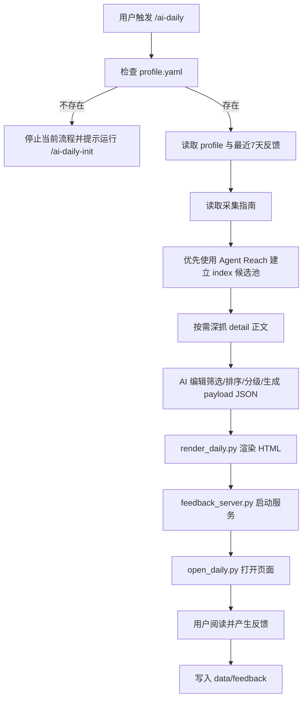
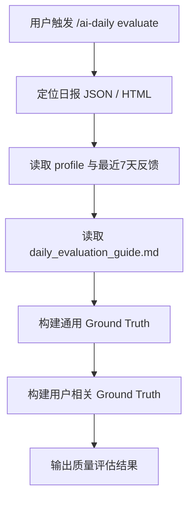

# AI 日报技能 PRD

## 1. 文档信息

- 产品名称：AI 日报技能
- 文档目标：沉淀当前技能的产品目标、能力范围、关键决策、流程设计、数据设计与评审重点，作为后续审核与迭代依据
- 当前阶段：可运行原型 / 技能化方案稳定期
- 适用范围：OpenClaw / Codex 类 Skill 场景下的 AI 日报生成与质量评估

---

## 2. 背景与问题

用户希望获得一份既有行业价值、又贴合个人兴趣的 AI 资讯日报，而不是一份泛泛的新闻聚合页。传统做法存在几个问题：

- 资讯源噪音大，头部事件、中文信号、研究信号、开源信号容易失衡
- 直接让模型整页手写 HTML，结构和交互容易漂移
- 只保留最终入选资讯，缺少原始采集证据链，难以复盘
- 日报生成后缺少反馈闭环，无法持续优化个性化排序
- 只会“生成”，不会“评估”，难以判断日报质量是否真的达标

因此需要一个技能化方案，把“个性化采集、结构化生成、稳定渲染、反馈闭环、质量评估”统一起来。

---

## 3. 产品目标

### 3.1 核心目标

1. 生成一份个性化 AI 日报
2. 让日报尽量优先命中用户当前真正关心的方向
3. 通过结构化中间层和模板渲染，稳定输出 HTML 成品
4. 保留采集原始数据，便于复盘和后续质量审计
5. 支持对已生成日报进行质量评估

### 3.2 成功标准

- 能根据 `profile + 最近 7 天 feedback` 输出个性化日报
- 采集阶段优先走 Agent Reach，且采用“先候选池、再深抓正文”的两阶段方案
- 生成流程稳定输出 `JSON -> HTML`
- 页面支持反馈上报，反馈可回流下一次日报生成
- 评估流程能够同时判断“通用质量”和“用户匹配度”

### 3.3 非目标

- 不做通用新闻爬虫平台
- 不追求对所有站点都做完美正文抽取
- 不做复杂后台系统或数据库服务
- 不在当前阶段追求全自动高并发生产部署

---

## 4. 目标用户

### 4.1 主要用户类型

- 技术研发
- 产品经理
- 技术管理者
- AI 研究员
- 市场 / 运营
- 综合关注用户

### 4.2 用户核心诉求

- 快速知道最近一周 AI 圈里最值得看的事
- 希望内容和自己角色、工作场景、兴趣方向有关
- 不是只要“摘要”，还希望知道“为什么和我有关”
- 希望日报越来越懂自己，而不是每次都从零开始

---

## 5. 产品定位

AI 日报技能不是单纯的新闻摘要器，而是一个：

- 面向个人兴趣的 AI 资讯编辑技能
- 兼顾“生成”和“评估”的双模式技能
- 以原始采集证据链、结构化中间层、稳定渲染、反馈闭环为基础的日报工作流

一句话定位：

> 一个能为具体用户持续生成、持续学习、并可被审计质量的 AI 日报技能。

---

## 6. 功能范围

### 6.0 模式零：初始化画像

初始化由独立技能 `/ai-daily-init` 负责，不再内嵌在 `/ai-daily` 主流程中。

初始化包括：

1. 环境检查（Python3、Agent Reach、飞书相关工具）
2. 飞书知识库读取与初始画像推断
3. 群聊绑定
4. 最近 7 天群聊历史热身
5. 来源探索与 Agent Reach 渠道适配
6. 写入扩展后的 `config/profile.yaml`
7. 执行初始化验收测试

### 6.1 模式一：生成日报

生成日报包括：

1. 检查 `config/profile.yaml` 是否存在
2. 若不存在，则停止当前流程并引导用户运行 `/ai-daily-init`
3. 读取用户画像和最近 7 天反馈
4. 执行资讯采集
5. 进行筛选、排序、分级、个性化解读
6. 输出结构化 `payload JSON`
7. 渲染成 HTML
8. 启动反馈服务并打开页面

### 6.2 模式二：评估日报

评估日报包括：

1. 定位评估对象
2. 读取 `profile.yaml` 与最近 7 天反馈
3. 读取评估指南
4. 从通用质量和用户匹配度两个维度评估日报
5. 输出结构化评估结果

---

## 7. 关键产品决策

### 7.1 从“整页手写 HTML”迁移到“JSON -> HTML”

早期方案依赖模型直接写整页 HTML，风险是：

- 页面结构漂移
- JS 反馈逻辑容易丢
- 模板样式不稳定

当前方案统一改为：

1. AI 只生成结构化 `output/daily/{date}.json`
2. 脚本 `scripts/render_daily.py` 稳定渲染 HTML

这样把“不稳定的结构生成”收回到模板渲染，保留 AI 在内容判断上的优势。

### 7.2 采集采用两阶段方案

已明确放弃“所有文章全文先抓下来”的方案，改为：

1. 第一阶段：轻量候选池采集
2. 第二阶段：按需深抓正文

这样可以显著降低：

- 文本量
- 噪音
- 无效全文抓取成本

同时更符合编辑工作流。

### 7.3 采集优先走 Agent Reach

当前产品决策是：

- 数据抓取默认优先使用 Agent Reach
- 如果当前环境未安装 Agent Reach，先按安装文档安装
- 只有在 Agent Reach 明显不可用或不足以完成任务时，才退回普通搜索 / fetch / reader

安装文档：

- [Agent Reach install.md](https://raw.githubusercontent.com/Panniantong/agent-reach/main/docs/install.md)

### 7.4 原始采集数据必须留存

采集不是只服务于“生成当天日报”，还服务于：

- 复盘为什么选了这些资讯
- 后续质量评估
- 召回与去重策略分析

因此产品要求必须保留：

- `output/raw/{date}_index.txt`
- `output/raw/{date}_detail.txt`

### 7.5 评估必须结合用户兴趣

日报评估不能只看“行业通用质量”，还必须看：

- 是否命中当前用户的角色与兴趣
- 是否与最近行为反馈一致

因此评估引入：

- 通用 Ground Truth
- 用户相关 Ground Truth
- User Fit 维度

### 7.6 初始化从主技能中拆出

当前方案不再让 `/ai-daily` 在首次运行时直接展开交互式配置面板，而是改成：

1. `/ai-daily` 只负责检查画像是否存在
2. 若缺失 `config/profile.yaml`，则中止本次日报生成，并明确引导用户运行 `/ai-daily-init`
3. `/ai-daily-init` 作为独立初始化技能，负责完成环境检查、画像推断、群聊热身和来源探索

这样做的原因是：

- 主技能职责更单一，聚焦“生成”和“评估”
- 初始化流程更复杂，适合单独维护和迭代
- 初始化失败时不会把主技能执行路径拖得过重
- 更符合技能体系中的渐进式读取与职责拆分

---

## 8. 用户流程

### 8.0 初始化主流程



### 8.1 生成日报主流程



### 8.2 评估日报主流程



---

## 9. 采集方案

### 9.0 通用资讯采集流程背景

为了便于审核理解，先说明一个更通用的资讯采集流程。通常一套成熟的资讯生产链路会分成以下几个阶段：

1. 发现线索
   - 从官方博客、媒体频道页、RSS、社区、GitHub、社交平台、搜索结果页中发现近期候选资讯
2. 建立候选池
   - 先记录标题、简介、来源、链接、发布时间、主题等轻量信息
   - 在这一层完成初步去重、时间过滤和来源分组
3. 深挖重点条目
   - 从候选池中挑少量高价值内容，继续抓取正文、发布说明、论文摘要或 README
4. 编辑加工
   - 对候选与深抓结果进行筛选、排序、合并、摘要和个性化解读
5. 发布与反馈
   - 生成最终成品，并采集用户行为反馈，供下一次迭代使用

本技能当前采用的方案，本质上就是在这套通用流程上增加了：

- Agent Reach 优先
- 最近 7 天时间窗口
- 原始采集数据留存
- 结构化 `payload JSON`
- 反馈驱动的个性化排序

### 9.1 时间窗口

- 默认抓取最近 7 天
- 用户显式指定日期或范围时，以用户要求为准

### 9.2 采集入口

优先入口：

- Agent Reach 的 RSS、网页搜索、社区搜索、GitHub、微博等可用渠道
- 官方 News / Blog 列表页
- 媒体 AI 频道页
- GitHub Trending / Release
- Hugging Face Blog / 社区页

### 9.3 采集产物

第一阶段 `index`：

- 标题
- 简介 / snippet
- 来源
- 链接
- 发布时间
- 频道 / 主题

第二阶段 `detail`：

- 标题
- 链接
- 发布时间
- 语言
- 清洗后的正文 / 发布说明 / 页面片段
- 抓取异常状态

### 9.4 HTML 清洗策略

当前抓取脚本会尽量对 HTML 做清洗，再把文本交给 AI，而不是直接把整页 HTML 源码交给 AI。

当前已做的处理包括：

- 自动识别 HTML
- 去除 `script`、`style`、`svg`、`nav`、`header`、`footer` 等标签内容
- 提取 `title` 和 `meta description`
- 裁剪明显噪音，如 `related content`、`footnotes`、`read more`

结论：

- 交给 AI 的通常是“清洗后的正文文本”
- 某些媒体站仍可能残留少量页面壳层噪音

---

## 10. 内容生产规则

### 10.1 排序原则

- 优先考虑“对这个用户是否重要”
- 重大行业事件可打破个性化兴趣偏好排到前面
- 避免同一主题过度挤占版面

### 10.2 结构要求

每条资讯至少包含：

- 标题
- 发生了什么
- 为什么重要
- 与你相关
- 标签
- 原文链接

全局还必须生成：

- 今日速览
- 行动建议
- 趋势雷达

### 10.3 质量约束

当前明确要求：

- 前 3 条优先放产品 / 模型 / 平台级重大变化
- 优先使用精确原始来源，而不是官网首页
- 保持一定信号多样性
- 减少空泛趋势评论，多写具体事件
- 左栏内容需与正文主线一致

---

## 11. 输出与交付

### 11.0 初始化产物

- 配置文件：`config/profile.yaml`
- 初始化验收报告：终端/对话中的结构化摘要

初始化后的 `profile.yaml` 在原有 `role / role_context / topics / daily / server` 基础上，可扩展包含：

```yaml
exclude_topics:
  - "加密货币"

feishu:
  group_id: ""
  tools:
    wiki_list: ""
    doc_read: ""
    chat_messages: ""

sources:
  direct: []
  search_seeds: []
```

补充说明：

- `exclude_topics` 用于显式降低无关方向的召回
- `feishu` 记录初始化阶段探测到的飞书上下文与工具映射
- `sources.direct` 保存初始化阶段探索出的直达来源页
- `sources.search_seeds` 保存可供采集阶段复用的种子搜索词

### 11.1 结构化中间层

- 路径：`output/daily/{date}.json`
- 作用：作为 AI 内容生成与 HTML 渲染之间的稳定接口

### 11.2 HTML 成品

- 路径：`output/daily/{date}.html`
- 由 `scripts/render_daily.py` 渲染

### 11.3 原始采集数据

- `output/raw/{date}_index.txt`
- `output/raw/{date}_detail.txt`

### 11.4 评估结果

- 推荐输出：`output/evaluations/{date}.md`

---

## 12. 反馈与个性化闭环

页面支持采集：

- 显式反馈：投票、收藏、标签关注
- 隐式反馈：停留时长、点击、交互密度
- AI 交互：用户把哪些内容继续交给 AI 工具处理

反馈写入：

- `data/feedback/{date}.json`

产品原则：

- 行为反馈优先于 profile
- profile 是用户的主观认知
- feedback 是用户的真实行为

---

## 13. 技术与文件结构

### 13.1 关键文件

- [SKILL.md](/Users/user/Documents/project/ai-daily/SKILL.md)
- [skills/ai-daily-init.md](/Users/user/Documents/project/ai-daily/skills/ai-daily-init.md)
- [reference/daily_collection_guide.md](/Users/user/Documents/project/ai-daily/reference/daily_collection_guide.md)
- [reference/daily_evaluation_guide.md](/Users/user/Documents/project/ai-daily/reference/daily_evaluation_guide.md)
- [reference/daily_example.html](/Users/user/Documents/project/ai-daily/reference/daily_example.html)
- [reference/daily_payload_example.json](/Users/user/Documents/project/ai-daily/reference/daily_payload_example.json)
- [reference/raw_capture_example.txt](/Users/user/Documents/project/ai-daily/reference/raw_capture_example.txt)
- [reference/feedback_schema.json](/Users/user/Documents/project/ai-daily/reference/feedback_schema.json)

### 13.2 关键脚本

- [scripts/render_daily.py](/Users/user/Documents/project/ai-daily/scripts/render_daily.py)
- [scripts/open_daily.py](/Users/user/Documents/project/ai-daily/scripts/open_daily.py)
- [scripts/feedback_server.py](/Users/user/Documents/project/ai-daily/scripts/feedback_server.py)
- [scripts/save_raw_capture.py](/Users/user/Documents/project/ai-daily/scripts/save_raw_capture.py)

---

## 14. 当前风险与限制

### 14.1 抓取质量风险

- 不同网站正文抽取质量不同
- 某些媒体站仍有页面壳层噪音
- 反爬、验证码、挑战页会影响可用性

### 14.2 渠道依赖风险

- Agent Reach 某些渠道需要额外登录、Cookie、代理或本地依赖
- 不同运行环境的可用渠道数可能不同

### 14.3 服务运行限制

- 本地 HTTP 服务可能受沙箱或系统权限限制
- 局域网访问会受到代理、网络隔离、路由器策略影响

### 14.4 评估的主观性

- Ground Truth 构建本身具有编辑判断属性
- User Fit 评估依赖 profile 与 feedback 的质量

---

## 15. 评审重点

未来审核建议重点看这些问题：

1. 当前采集链路是否真的优先走了 Agent Reach
2. 原始采集数据是否完整留存，是否能支持复盘
3. `index -> detail -> payload -> HTML` 这条链路是否稳定
4. 日报是否真的结合了用户画像和最近反馈
5. 页面反馈采集是否可用，数据结构是否一致
6. 评估流程是否同时考虑通用质量和用户匹配度
7. HTML 模板、数据契约和脚本说明是否保持一致

---

## 16. 后续建议

### 16.1 近一步优化

- 补充生成后自检机制
- 对原始抓取结果增加更明确的异常状态标记
- 进一步优化媒体站正文抽取
- 增强候选池与最终入选条目的可追溯关系

### 16.2 中期方向

- 增加更稳定的 `payload schema`
- 增加自动化评估输出
- 提升多渠道采集质量和时效性

---

## 17. 结论

AI 日报技能已经从“单次生成页面的提示词型方案”，演进为一套更完整的技能工作流：

- 采集上采用 Agent Reach 优先的两阶段方案
- 生成上采用 JSON 到 HTML 的稳定渲染
- 反馈上具备行为回流闭环
- 评估上具备用户兴趣参与的质量判断

当前最适合作为“可评审、可迭代、可继续产品化”的技能原型。
